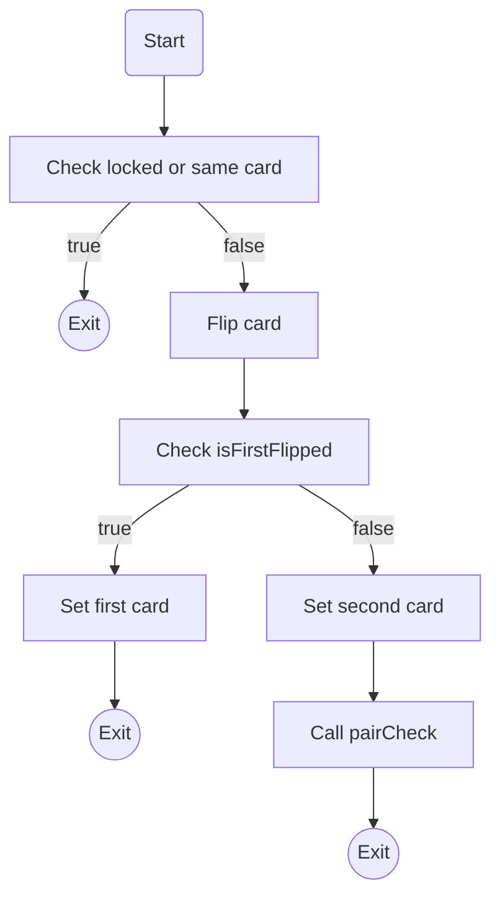
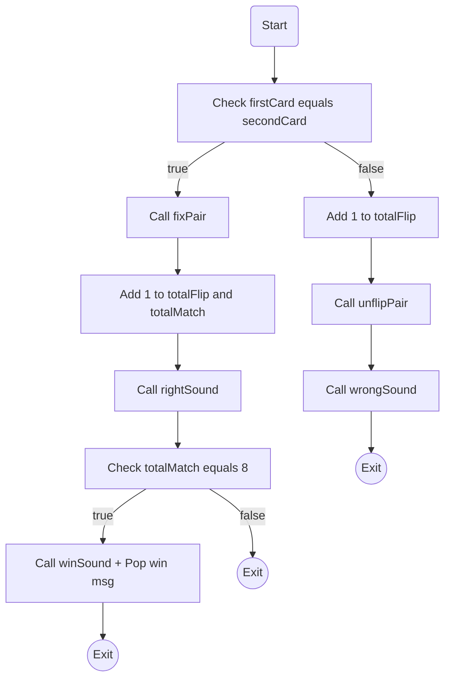

# Project Overview 
This project consists of a memory match game, made for the Let's Code fullstack course. It's been developed with HTML, CSS and Javascript vanilla.
The game is themed as a jungle environment. The cards were made from animal pictures for better immersion.
It's a common memory match game, with a fixed deck of 16 cards (8 pairs). You click a card to flip it and see its content. When you flip the second card,
it will be ckecked if they are the same. If they are, you get a match count and they are kept open. If they are different, both are hidden again and the game
continues. At the start of the game (start or restart buttons were implemented), the player has five seconds to memorize the cards. When all the pair have been
discovered, the game ends.

# Program Structure

## HTML and CSS

The page has a forest picture on the background, with a deck of cards spread on the center and two displays beside it. One is for the total number moves and the
other for the total pairs found. The structure of the HTML was build with DIVS. The main one was set as a grid container, where the cards, inside another DIV
(styled using flexbox), are evenly positioned.  
Each card back, front and flip mechanics were simulated using the CSS 3D transformation. Two images are overlapped and when you click the DIV element that represents
a card, the images rotate 180 degrees, what makes one be concealed and the other appear.

## Javascript

### Variables declaration

At the top of the script.js file, were declared some variables. The ones from lines 1 to 6, were declared for catching elements from html, for easy manipulation.
An array, with 16 items was also declared. This array will serve as our card deck. Everytime a new game starts, the deck items will be shuffled and the order of
the cards on screeen will change randomly. The other variables are all declared with let. They are explained in more details next.

- **started**: this variable will be used to check if the game has started. The page opens with its value set as FALSE, so the player will have to hit start button to
initiate a game. After starting it, START button will be disabled, making only the RESTART button available to create a new game.
				
- **isFirstFlipped**: this variable is initiated as FALSE. When the player clicks a card, this variable will be checked to see if it's the first or second card that has
been chosen. This is necessary to avoid two clicks on the same card or more than two cards clicked.

- **firstCard** and **secondCard**: both variables are used to store the click target. The values stored are used to compare if the cards are the same, so the program can
keep them open or flip them back if they are different.
									
- **totalFlips** and **totalMatched**: both are used to store the number of flipped pairs the player has made. One stores just the right pairs flipped, while the other stores
the total number of moves.
									
- **locked**: This variable is started as TRUE. This will prevent the player to click on the cards and flip them before the game starts.It will be changed to FALSE after START
or RESTART buttons are pressed. It's also used when unflipping cards that didn't match, so it prevents the player to flip other cards between moves.
			
### Functions

For the proper function of the program, a few functions were created, so they could be called when necessary. In this section, they will be explained individually.
	
- **flipCheck**: This function is used as the imput for the *addEventLisener* attatched to all the cards, and is the base of the game. After game starts, everytime
the player clicks a card on the screen, it will call this function.

- **pairCheck**: This function checks if the two cards flipped are equal. The comparison is made using the values stored in the *firstCard* and *secondCard* variables.
It actualy checks if the *.innerHTML* element properties are the same on both. This is possible because the *.innerHTML* from each card has the exact same structure, only
differing on the card picture path. So, if the path is the same, the properties are the same. 

- **fixPair**: This function just removes the click event from the cards when they match.

- **unflipPair**: Function that flips cards that don't match down again, so player can keep trying.

- **rightSound**: Plays a sound when the chosen cards match.

- **wrongSound**: Plays a sound when the chosen cards don't match.

- **winSound**: Plays a sound when the player flips all cards and win the game.

- **shuffle**: The function shuffles the deck array items using the Fisher–Yates algorithm. The array items are the IDs of each card DIV. After that, the array (with all items randomly
rearanged) is mapped and, for each item, it defines the *order* property of each DIV accordingly to their *index*. Since the DIVS are items from a flexbox, after their *order* property
is modified, their position on the screen will change, even though they are always the same in the HTLM file.

- **btnStart**: This is the start button script. It will alert the user, give some information, shuffle the cards, show them 5 seconds for the player and then, the game begin. The *start*
button will only be used once. After that, only *restart* will be available.

- **btnRestart**: This function is responsible for the *restart* button. It will only be available after the use of the *start* button. This button does averything the *start* button does,
and also asks the player if he/she really wants to restart the game and also resets both move counts.

- **timer**: This function is used on *start* and *restart* buttons. When called, it flips all the cards up, showing their front. After 5 seconds, it unflips all. You can realize here
that the *timer* is responsible for showing the cards for the player to memorize on every new game.

- **closeModal**: This function just lets the player exit the winning message after game ends. The message is presented as a modal (very similar to the one worked at one of the Let's Code
classes.

- **btnRestartBlock** and **btnStartBlock**: These are responsible for disabling the buttons when the game is started or restarted. This prevents the game from bugging in case the player
keeps clicking non stop on the buttons.

### Listening Events

Finally, at the end of our script.js file, we add all the events that need to be mapped, and that are responsible to the game dynamic. First the cards event, and last, the close modal
events.

# Final Consideration

I hope that this project helps everyone that access it. 
I also want to thank my Lets Code teachers, Larissa, Wallison and Andrews for all the knowledge they provide, with so much passion.

###### Contact
E-mail: rubens_p_souza@hotmail.com
  